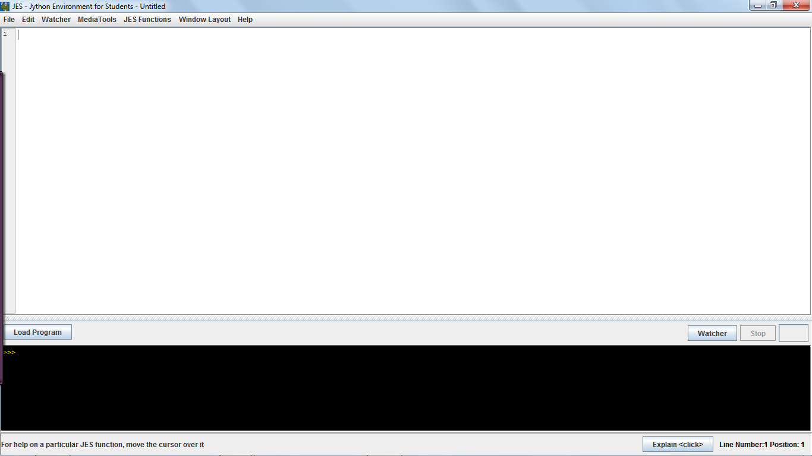
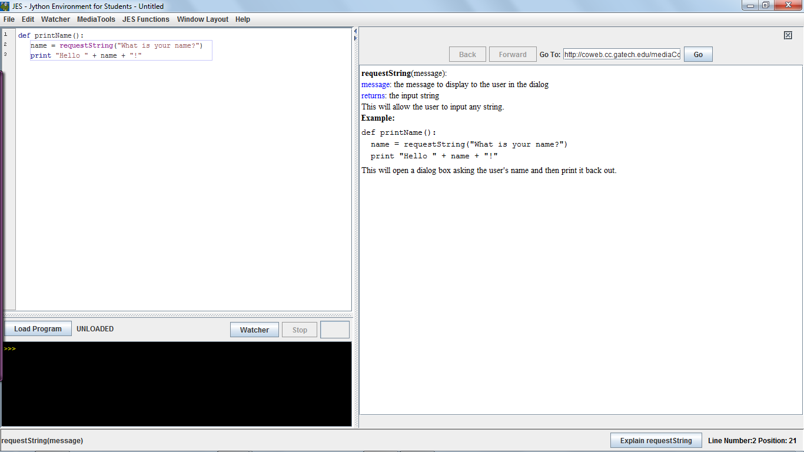

Getting around with JES
========================

This is a quick tutorial for getting started with JES. For more
information, you can go to the “help” menu in JES.

Installing JES
---------------

You should download and install JES.

Getting Started
----------------

What is JES
^^^^^^^^^^^^

The Jython Environment for Students is a programming environment
that allows a person to create, open and edit Jython programs. It
helps to make changes to sounds, images and videos.

This is how JES’s default page looks like.

Note: This is on a pc. It might look a bit different on Macs.

If you have never used an IDE to write code before, I’ll write to
you what this window is all about.

#. The top part with the white window is the program area where you
   can write codes and save it under a filename with a .py extension
   and submit them to moodle. The bottom part in black is the command
   area.
#. There are a couple of other menu options in JES you need to be
   familiar with. The “load program” runs the codes that you write.
   The “stop button” is used to cancel loading a program that is
   repeating endlessly. The “Explain<Click>” button explains how to
   use the built in functions that come with JES. There are more built
   in functions that you can find under the JES Functions menu.

