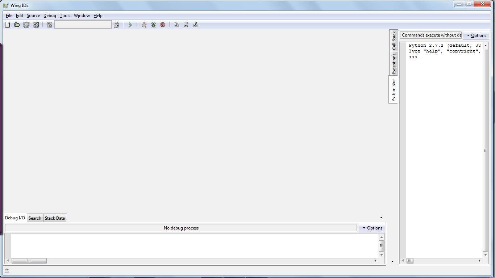
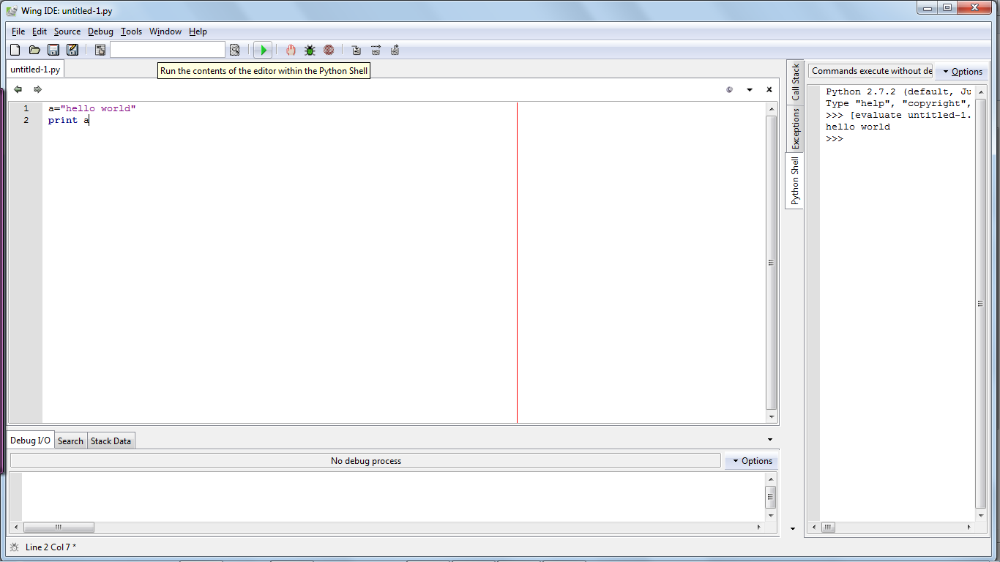
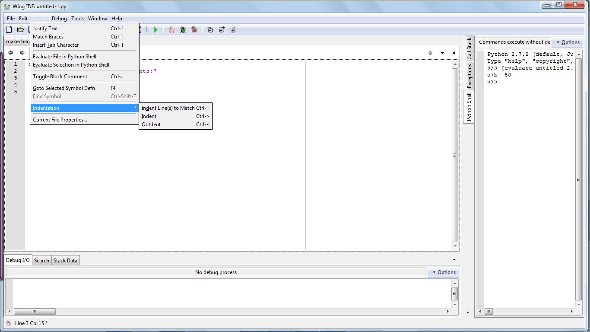
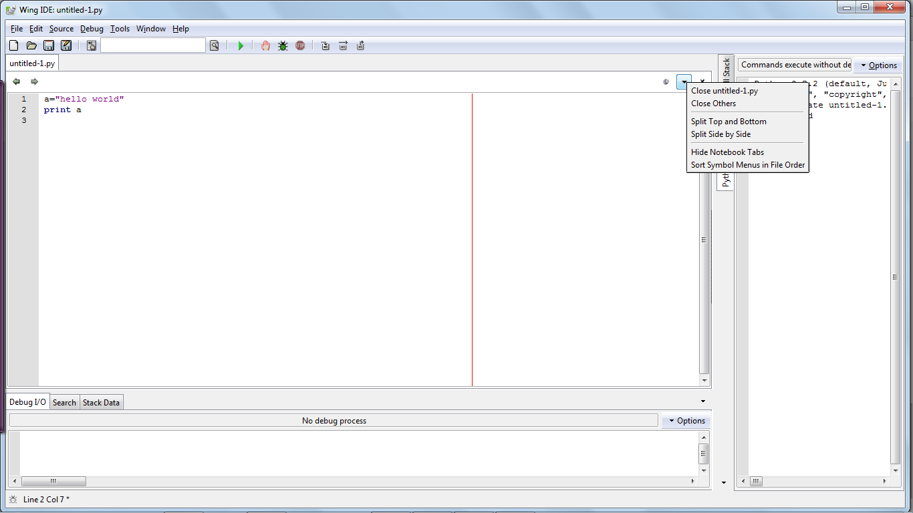
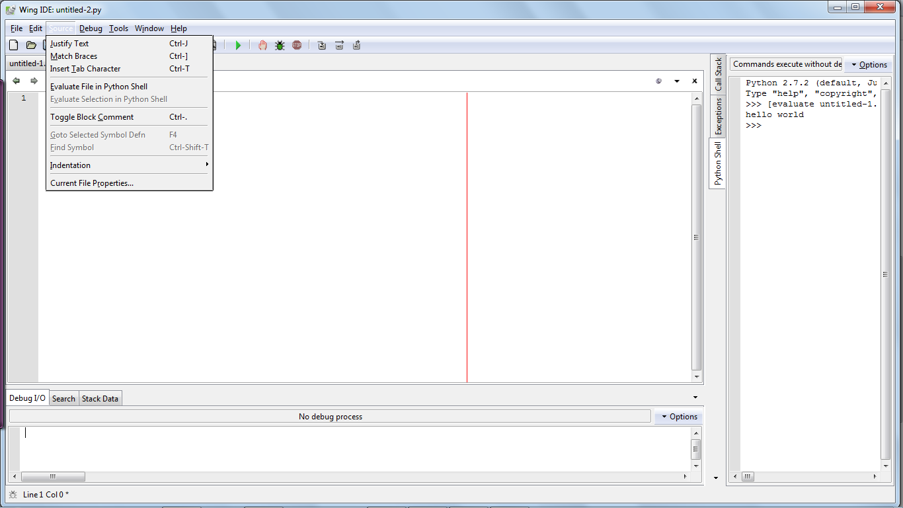

Wing Quick Tutorial
===================

Overview
--------

This is a guide for getting started with Wing101 v.4 as soon as
possible. For more information you can access the reference manual
under the help menu in Wing.

Install Python and Wing
-----------------------
- A downloaded copy of Wing IDE.

- A supported version of Python. We are using Python 3.

Getting started
----------------

Wing Starts automatically with a blank default page. This is how it
looks at first.

You need to create a new file to get started under the file menu.
Here you can write your first hello world program. You can run your
code by clicking on the green icon as shown below.

Some quick things about Wing
----------------------------

#. Wing maps the ctrl-= key for pc and cmd-= key for macs to indent
   to match by default for Python or you can get the indentation from the source menu.

2. You can customize your preferences by splitting into two and
   opening multiple files at the same time.

3. You can evaluate a file in the python shell from the source
   menu.

4. Python Shell -- This Python command prompt lets you try out code
   in a sandbox process kept isolated from Wing IDE and your debug
   process. The python shell is on the right side with a >>>.
5. Basic Debugging -- Set a breakpoint and start debugging. The bug
   icon helps you debug your codes.You can debug
   your code by clicking on the bug icon. For more information about
   debugging, you can access the Debugging with Wing text. You should
   save the files you create for later use.

6. Conditional breakpoints -- A powerful tool in isolating complex
   bugs by stopping before they occur.

