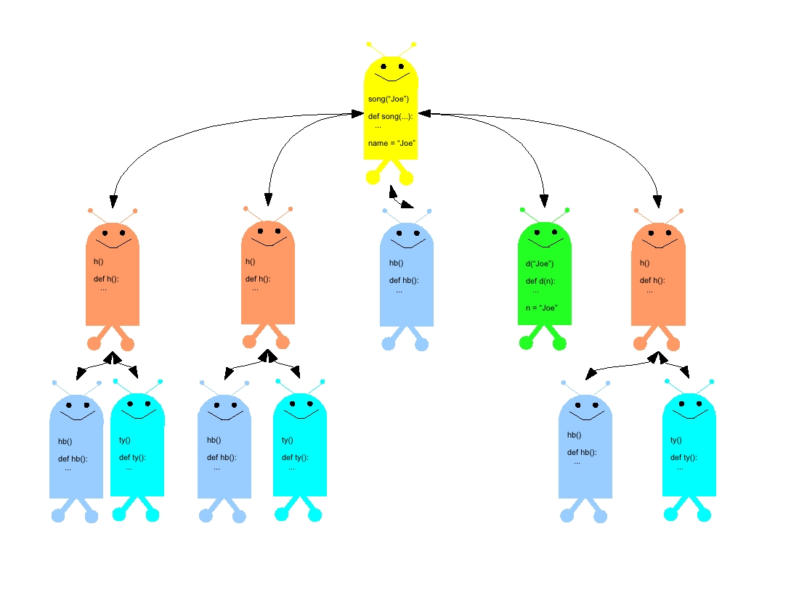

Calling and Defining Function
=============================

**Comp 123**

Overview
--------

These activities will practice with using and writing functions,
and will talk about how function calls work inside the computer,
and a "happy robots" metaphor for understanding function calls.

Be sure to download the
:download:`functionscode.py <functionscode.py>` file.

Important ideas about functions
-------------------------------

Functions we define, like the programs we have been writing before
this, are a way of describing an *algorithm* to the computer. A
function has the benefit of doing all its work in its own "space,"
which is separate from the main, global space.

Let me use a metaphor to describe the difference between programs
and functions. Suppose you have a friend who is an artist, and you
ask this friend to paint a picture for you. Running a program in
Python is like inviting your friend to come into your room and
paint a picture for you: the result may be fine, but paint may get
splashed on other things. In the same way, a program running in
Python may add variables to the global namespace, and may overwrite
variables that already existed there.

On the other hand, calling a function is like asking your friend to
paint the picture in her studio: you tell her what kind of picture
you'd like, she does the work in her own space, and returns the
resulting picture to you. Whatever the artist did while painting
the picture, it happened in her own space.

Read the following function.

.. sourcecode:: python

    def foo(x, y, z):
        q = max(x, y)
        r = max(y, z)
        s = max(x, z)
        return min(q, r, s)

By itself, a function definition does not do anything, any more
than reading a recipe for cherry pie causes the pie to materialize
on the kitchen counter. In order to execute, or invoke, this
function, we need to "call" it. A function is called by listing its
name and then, in parentheses, giving any input values the function
needs. We've already seen some examples of this, with built-in
Python functions like `abs` and `move`.

When we call a function we pass it inputs that it needs to do its
work. Some functions just do their work and end, but many functions
return actual useful values. In order to use those values, either for
further computations or to show them to the user, we need to assign
the value to a variable, or pass it to another expression or
statement. Let me use another metaphor to explain what I mean: you
can think about calling and returning values with a function as
being like a game of catch: you throw the input parameter values to
the function when you call it, and the function throws the return
value back to you. You need to catch the return value in order to
use it.

Try to predict what values the function calls below would return.
Then test yourself by typing the function into the activecode and trying out
the examples. Note that I show a variety of ways to
catch the value returned by the function foo.

 .. sourcecode:: python

      val1 = foo(10, 15, 17)
      print val1
      print foo(15, 10, 17)
      print foo(17, 10, 15)
      val2 =foo(10, 20, 10)
      print "The value of foo(10,20, 10) is", val2

 .. activecode:: act_func_01

 .. codelens:: act_func_01

    def foo(x, y, z):
        q = max(x, y)
        r = max(y, z)
        s = max(x, z)
        return min(q, r, s)

    val1 = foo(10, 15, 17)
    print val1
    print foo(15, 10, 17)
    print foo(17, 10, 15)
    val2 =foo(10, 20, 10)
    print "The value of foo(10,20, 10) is", val2

Try changing the function above by putting in `print` statements as
shown below.

.. sourcecode:: python

    def foo(x, y, z):
        print "Starting foo with x =", x, "y =", y, "z=", z
        q = max(x, y)
        print "q =", q
        r = max(y, z)
        print "r =", r
        s = max(x, z)
        print "s =", s
        ans = min(q, r, s)
        print "Ending foo with value", ans
        return ans

.. activecode:: act_func_02

Now you can see what happens: when a function is called, the values
that are passed as arguments are *temporarily* set, or "bound" to
the parameter variables. Then, the function's body is executed with
those bindings in place. The `return` statement tells the function
what value to send back as the value of its call. The value of a
function call takes its place in any expression that uses it, much
like the value of `5 * 2` takes its place in the larger
expression `(5 * 2) + 3`.

.. note:: A value that is returned by an expression or a
      function call is different from a value that is printed by an
      expression or a function call. When printed, the value appears to
      us, the users, but is no longer available for the program to use. A
      value that is returned can be used in other expressions, or other
      function calls.

Compare these two functions and then try the calls in the activecode.

.. sourcecode:: python

    def poly1(x):
        return 3 * (x ** 2) - 1

    def poly2(x):
        print 3 * (x ** 2) - 1

    # Which of these two expressions will work correctly? Why?

     poly1(1)+ poly1(2)
     poly2(1) + poly2(2)

.. activecode:: act_func_03

Practice defining functions
---------------------------

Practice defining functions with the following examples. The first
one is plain Python, and try the rest.
Put your definitions in the editor below.

#. Define a function called `printName` that takes a single input,
   a string. It should print a welcome message that says `Welcome to
   Comp 123,` and then the name See the example below:

   .. sourcecode:: python

       >>> printName("Froggie")
       Welcome to Comp 123, Froggie
       >>> printName("Elsa")
       Welcome to Comp 123, Elsa

   .. actex:: act_func_04

#. Define a `repeatString` function that takes a string as input,
   and an integer, `n`. It should return a new string that is a copy
   of the input string, copied `n` times.

   Once you have defined the function, it should behave as in the
   following example:

   .. sourcecode:: python

       >>> repeatString('hank', 3)
       'hankhankhank'
       >>> repeatString(' ',10)
       '          '
       >>> repeatString("A man, a plan, a canal - Panama!", 0)
       ''

   .. actex:: act_func_05

#. Define a function called `ave3` that takes three numbers as
   inputs: `x`,`y`,`z`. It should compute the average of the three
   by adding them up and dividing by `3.0`. It should *return* the
   resulting value.

   .. sourcecode:: python

       >>> ave3(2, 3.0, 4.0)
       3.0

   .. actex:: act_func_06

*Challenge functions for those who get done quickly*

#. Define a function that takes two strings as its inputs. It
   should return the total length of the two strings. The built-in
   `len` function will report the length of a string:
   `len("abc") = 3`.

   .. actex:: act_func_07

#. Suppose a country's tax code calls for a flat income tax rate of
   12% on the first $50,000 of income. Any income over $50,000 has a
   tax rate of 20%. Thus, if I make $75,000 in income in a year, then
   my income tax will be :math:`50,000 * 0.12 + 25,000 * 0.2`, or
   $11,000. Define a function `incomeTax` that takes two numbers as
   inputs. The first number is the person's income up to $50,000. The
   second input number is the part of the person's income that exceeds
   $50,000. The function should return the income tax owed (based on
   the formula above). See the examples below:

   .. sourcecode:: python

       >>> incomeTax(50000, 25000)
       11000.0
       >>> incomeTax(42000, 0)
       5040.0
       >>> incomeTax(50000, 130000)
       32000.0
       >>> incomeTax(12000, 0)
       1440.0
       >>>

   .. actex:: act_func_08

Functions calling functions: Happy Robots
-----------------------------------------
Calling a single function and having it return is often pretty easy
to understand. But what if one function calls a second, which calls
a third, and so on. Take a look at the set of functions in
:download:`functionscode.py <functionscode.py>`  that start with the `song` function. Without
running the program, try to predict what the output would be. Then
run it, to see how you did!

How does the computer keep track of which function has called which
other one? The book talks about "stack frames," which are the tool
used by the computer to keep track of function calls. Each time a
function is called, the computer allocates a "stack frame" that
contains information about both the called function, and the place
in the calling program where control and the function's value
should return once the function call is over.

I like to use a metaphor instead of the details of stack frames; I
call it the Happy Robots metaphor. This is how it works:

When a function is defined, its definition is stored away in the in
Python's global namespace, which is a table where functions and
other values can be looked up by name. Now, suppose that someone
asks Python to evaluate a function call. Imagine that somewhere in
the computer is a collection of happy robots, just waiting for a
chance to execute some code. When the function call happens, one of
the robots is selected and assigned that call.

The robot always does four things:

#. It gets a *copy* of the function definition from the namespace,

#. It stores within itself the values for each input parameter from
   the function call, making its own temporary local namespace,

#. It works through the steps of the function definition, perhaps
   creating new happy robots for any function calls within it, and

#. It returns control, and possibly a value, to the point where the
   function call took place.

Information passes two directions: to the called function by way of
its parameters, and from the called function by way of its returned
value (the game of catch, remember?). The computer keeps track of
the happy robots that represent functions that have been called,
but have not yet returned.

The picture below shows the set of happy robots that would be
created for the program in `song.py`. Generally, happy robots on
the same row would be called in sequence, left to right.

If there is time, we will work through how this example works
together in class.

.. actex:: act_func_09