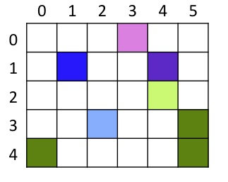
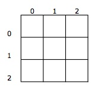

Rotating, Reversing, and Other Manipulations
=============================================

Here are some additional manipulations of images and
sounds to try.

Rotating images
---------------

The pictures below show the same tiny sample image from the
mirroring activity. Here, the image has been rotated left 90
degrees, right 90 degrees, and turned upside down.
.. note:: there are also  rotations that involve flipping the image over, but we're not  looking at those.

Rotation requires us to build a new picture, since most of our
source pictures are not square, and therefore, when rotated, have
different dimensions than the starting pictures. For now we'll
assume that we're going to rotate the image 90 degrees to the
left.

    .. figure:: Images/mirrorOrig.jpg
       :align: left
       :alt: image

       *mirror Original*

    .. figure:: Images/rotateLeft.jpg
       :align: center
       :alt: image

       *Rotate Left*

    .. figure:: Images/rotateRight.jpg
       :align: left
       :alt: image

       *Rotate Right*

    .. figure:: Images/upsideDown.jpg
       :align: center
       :alt: image

       *Upside Down*

*As before, think about the following questions, discuss them with
a partner.*

#. First of all, if our input image has width `w` and height `h`,
   what is the width and height of the new picture?

#. Think about how to map locations in the source picture to
   locations in the target picture. What pixel in the new picture
   corresponds to pixel (2, 3) in the original picture? How about
   these pixels in the source picture: (0, 4), (4, 1), (5, 3), (5,
   0)?

#. Can you find the pattern? How can you compute the target x and y
   values for a given source x and source y?

Try this:
^^^^^^^^^

Define a function `rotateRight` that takes a picture as input. It
should build and ultimately return a new picture object. The new
object should hold the original picture, rotated to the left 90
degrees.

Other Rotations
~~~~~~~~~~~~~~~

The process is very similar for rotating right 90 degrees instead
of left, and also for rotating to an upside down position. **If you
have time, implement one of these rotations.**

**What if we want to flip an image over, horizontally or vertically?
Is that more like mirroring or rotating?**

Copying
-------

To copy pixels from one picture to another, we need to keep track
of the location of the source pixel, and also the location of the
target pixel. It isn't always easy to calculate the target location
from the source location, so an alternative method is to keep track
of the target x and y values as local variables. Below is a sample
copy function that copies one picture to a larger picture, always
at the same location. The location in the large picture is given by
the (x, y) location where the upper left corner of the small
picture should be.

.. sourcecode:: python

    def copyDemo(smallPic, bigPic):
        targetX = 25
        for sourceX in range(getWidth(smallPic)):
            targetY = 25
            for sourceY in range(getHeight(smallPic)):
                srcPixel = getPixel(smallPic, sourceX,sourceY)
                tgtPixel = getPixel(bigPic, targetX, targetY)
                setColor(tgtPixel, getColor(srcPixel))
                targetY = targetY + 1
            targetX = targetX + 1

Try this:
^^^^^^^^^

Modify this program so that it chooses a random starting position
in the big picture. Import the `random` module, and use the
`randint` function to generate valid random x and y values. Start
the picture at that point.

.. note:: If you aren't careful the
          small qpicture will be too close to the right edge or the bottom
          edge, and the copy won't work! Note that some of the pictures in
          the MediaSources file are very small: `caterpillar.jpg` and
          `flower1.jpg`, for instance.

Scaling Down
------------

Changing the scale of a picture can be complicated. We're just
looking at the easy case of making a new copy of a picture half the
size, or twice the size of the original.

To scale a picture to half the size, we need to leave out every
other row and every other column of pixels. Assuming we include the
first row and column, look at the picture below, and draw the
half-size image that would result.

   *mirror Original*

   *Tiny Image*

Now, think about how the source and target values relate to each
other. Which would be easier to choose as the "main" region, source
or target? I find it easier to contemplate using the target region
as the main one, since we need to iterate through every target
pixel, but only some of the source pixels.

Try this:
^^^^^^^^^

Define a function called `scaleDown`. This function should take a
picture and create a new one that is half the size. You will need
the `math` module to properly compute an integer size:
:math:`\lceil \frac{w}{2} \rceil` and
:math:`\lceil \frac{h}{2} \rceil`.

It should create a return a picture half the size of the original.
Skip every other column and every other row in the original
picture.

Scaling Up
-----------

Scaling up to twice the size requires us to put multiple copies of
each pixel in the target picture. Each pixel from the source
becomes four pixels in the target. Try that with the example
below:

    .. figure:: Images/mirrorOrig.jpg
       :align: left
       :alt: image

       *Mirror Original*

    .. figure:: Images/hugeimage.jpg
       :align: center
       :alt: image

       *Huge Image*

We can implement this function in two ways. One is to loop over the
source pixels, and for each source pixel, compute the locations of
the four target pixels, and set them to the right value. The other
way is to loop over the target pixels, and use quotient and
remainder calculations to compute the source pixel that corresponds
to each target pixel.

Try this:
^^^^^^^^^

Implement a function called `scaleUp` that takes a picture and
makes a new copy twice as wide and twice as tall.

Note that scaled up pictures often look blocky, because in essence
we have doubled the size of each pixel. A better version might,
instead of copying one pixel to four locations, compute the average
between two existing pixels and place that in the new pixel
location. If you have time, try this!

Reversing sounds
----------------

Reversing a sound can produce interesting results. It is a fairly
simple process: create a new sound the same size as the original.
Loop over every location in the original sound, and copy the sample
value from that location. Put that sample value into the correct
location in the new, target sound.

Below is an example of a small list of numbers; suppose it is a
very small sound file. With a partner, figure out which indices in
the source sound map onto indices in the target sound. Can you find
a formula for computing the target index given the source index?

    +----+----+-----+----+----+----+----+
    |   0|   1|    2|   3|   4|   5|   6|
    +----+----+-----+----+----+----+----+
    | 553| 981| 1205| 877| 369| 102|  35|
    +----+----+-----+----+----+----+----+
    |    |    |     |    |    |    |    |
    +----+----+-----+----+----+----+----+

Write a function `reverseSound` that takes a sound object as input,
and returns a new sound object that is the original, reversed.

Scaling sounds
--------------

When we scale a sound to make it half as long, in the process we
make the frequencies in the sound shorter, and therefore the pitch
is higher. Similarly, we can scale a sound to make it twice as
long, and therefore the pitch becomes lower.

Try this:
^^^^^^^^^

Create a function `raisePitch` that takes a sound object. It should
make a new sound object half the length, and it should copy every
other sample value from the original to the new sound. Return the
new sound at the end.

Try this:
^^^^^^^^^

Create a function `lowerPitch` that takes a sound object. It should
make a new sound object twice the length of the original, and it
should copy each sample value from the original to two adjacent
positions in the new sound object. Return the new sound object.

